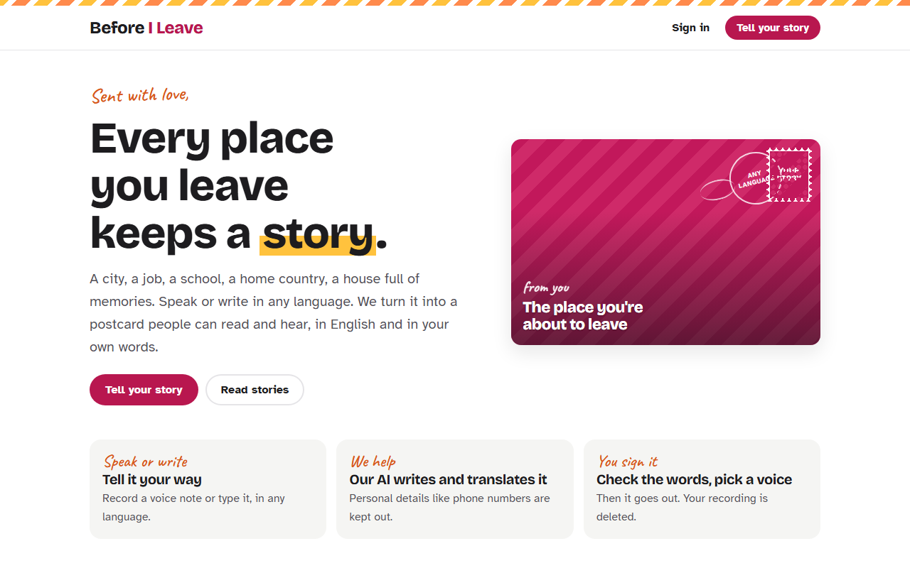
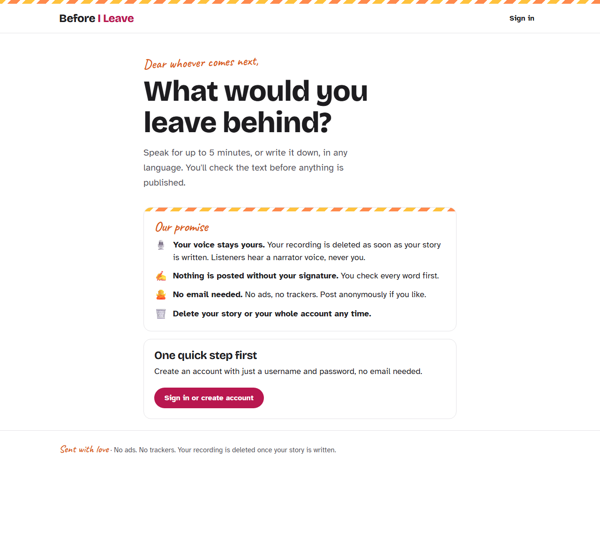
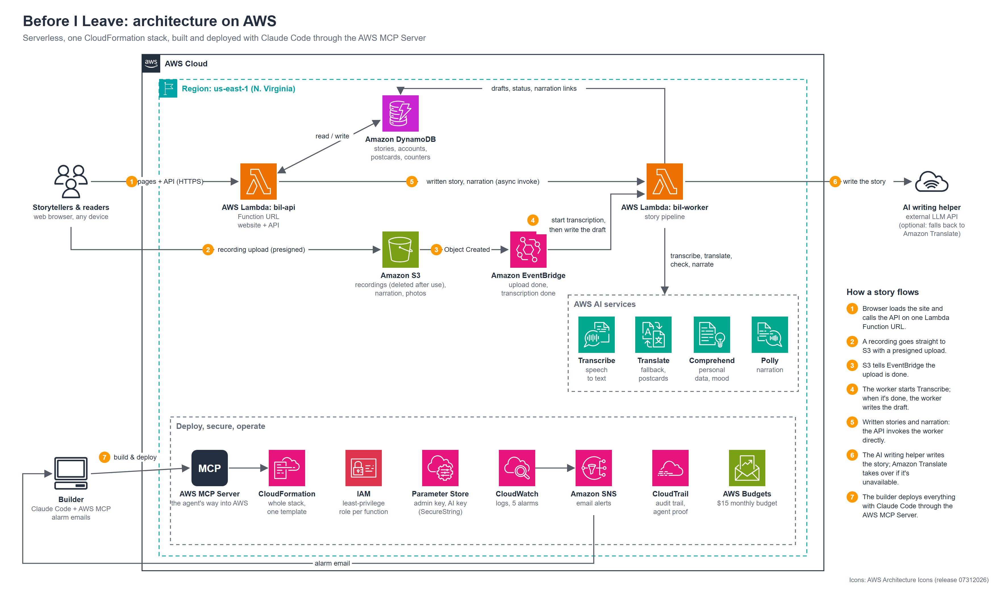

# Before I Leave

**Every place you leave keeps a story.** Speak or write it in any language, and it becomes a postcard that people can read and hear, in English and in your own words.

**Live app:** https://7ow3episakwa4rzliavyjxmbjm0rosdl.lambda-url.us-east-1.on.aws/
Built for the AWS Builder Center *Zero to Shipped* hackathon · Personal Expression · Community



## What it does

- **Speak or write.** Record up to 5 minutes or type up to 3,000 characters, in any of about 60 languages.
- **A postcard in two languages.** The story is written down in the storyteller's language and in English, with a title and a mood, and narrated in both languages where a voice exists.
- **Nothing goes out unsigned.** The storyteller checks every word before publishing. The story is live at once and the narration follows a few seconds later.
- **Write back.** Readers can send the storyteller a private postcard. Only the storyteller can read it.
- **Your voice stays yours.** The recording is deleted as soon as the story is written. Listeners hear a narrator voice, never the storyteller. Stories can be posted anonymously ("from a stranger"), and accounts can be deleted with everything in them.



## How it works

[](docs/architecture.svg)

*Built with the official AWS Architecture Icons. Click the diagram for the full-resolution SVG.*

1. **Spoken story:** the browser uploads the recording straight to S3 with a presigned POST. EventBridge starts an Amazon Transcribe job; its completion event triggers the worker.
2. **Written story:** the API invokes the worker directly. There is no recording and no transcription.
3. **Draft:** an AI writing helper writes a faithful story in both languages (or, for written stories, keeps the writer's words or polishes them, as they choose). If the helper is unavailable for any reason, Amazon Translate and Comprehend produce a plain draft instead, so a story never fails because of the AI. Comprehend removes contact details on every path.
4. **Publish:** the story goes live immediately. The worker narrates every paragraph of both languages in parallel with Amazon Polly (generative voices where available) and attaches the audio. If the storyteller saves again while narration runs, the newest save wins.

| AWS service | Job |
|---|---|
| AWS Lambda (+ Function URL) | One function serves the website and the API; a second one runs the story pipeline |
| Amazon S3 | Recordings (deleted after use), narration, photos; lifecycle rules as a cleanup backstop |
| Amazon DynamoDB | Stories, accounts, sessions, postcards, counters (on-demand, TTL for expiring items) |
| Amazon EventBridge | Upload finished → transcribe; transcription finished → write the draft |
| Amazon Transcribe | Speech to text, with the narrator's language or automatic detection |
| Amazon Translate | Translation fallback, "Translate my changes", translating postcards |
| Amazon Comprehend | Personal-data removal, language detection, mood and title fallback |
| Amazon Polly | Narration in both languages |
| Amazon CloudWatch + SNS | 5 alarms (runaway worker, API flood, worker errors, AI fallbacks, AI needs attention) emailed to the admin |
| AWS Systems Manager Parameter Store | Admin key and AI key as SecureStrings |
| AWS CloudFormation | The whole stack is one template: `app/infra/template.yaml` |

## Safety, privacy and cost guardrails

- **Cost ceilings on every expensive step:** 3 stories a day and 10 in total per account, 30 a day and 200 in total site-wide; recordings up to 5 minutes and written stories up to 3,000 characters; at most 5,000 narrated characters per language; 6 saves and 10 translations per story; no automatic retries in the pipeline.
- **The AI is an upgrade, not a dependency:** bounded retries with backoff, a 70-second time budget, and a circuit breaker. Problems that need a person (billing, key, model name, daily quota) pause the helper and email the admin.
- **Abuse:** open sign-up capped per hour, password lockout after 10 wrong tries, one report per person, and stories hidden after 3 reports from accounts older than a day (the admin is emailed). Postcards: 3 per reader per story, 10 a day, 500 characters.
- **Privacy:** recordings, transcripts and Transcribe jobs are deleted as soon as a story is written or fails. Contact details (phone numbers, emails, addresses, full names) are removed automatically; the storyteller's own review is the final check. Anonymous posting, deleting a story or the whole account, no email needed, no ads, no third-party scripts, self-hosted fonts and a strict Content Security Policy.
- **Least privilege:** each Lambda function has its own role, scoped to the exact table, bucket prefixes, parameters and actions it uses.

## Built with a coding agent

The app was built and shipped with **Claude Code connected to AWS through the AWS MCP Server** (Agent Toolkit for AWS). The agent checked service limits, prices, voices and API behaviour against live AWS data and documentation, deployed every version through CloudFormation, read CloudWatch logs to find and fix problems, and ran the live end-to-end tests.

**Proof of the connection** (screenshots, the CloudTrail record of the first call, and CloudTrail totals: 120+ calls through the AWS MCP Server, every one from Claude Code, and 14 stack deployments made through it): [docs/agent-connection-proof](docs/agent-connection-proof/).

## Deploy it yourself

Requirements: an AWS account, the AWS CLI, Python 3, and a key for the AI writing helper (the stack parameters `AiEndpoint` and `AiModel` choose the provider and model). Deploy in **us-east-1** (the S3 CORS rule and the voice list assume it).

```bash
python app/build.py                                   # creates app/build/code.zip
aws s3 cp app/build/code.zip s3://YOUR-CODE-BUCKET/v1/code.zip
aws ssm put-parameter --name /before-i-leave/admin-key --type SecureString --value "A-LONG-RANDOM-STRING"
aws ssm put-parameter --name /before-i-leave/ai-key --type SecureString --value "YOUR-AI-API-KEY"
aws cloudformation deploy --stack-name before-i-leave --template-file app/infra/template.yaml \
  --capabilities CAPABILITY_IAM \
  --parameter-overrides CodeBucket=YOUR-CODE-BUCKET CodeKey=v1/code.zip AlertEmail=you@example.com
```

Confirm the SNS email, then open the `SiteUrl` stack output. The moderation page is `/admin.html` (it asks for the admin key). To ship a new version, upload the zip under a new key (for example `v2/code.zip`) and deploy again with that `CodeKey`.

## Tests

```bash
python app/tests/test_offline.py
```

Offline tests (no AWS needed) cover the AI helper's failure handling (rate limits, outages, billing, bad keys, safety blocks, broken or shortened output), written drafts in both modes and their fallback, the "newest save wins" narration rule, and account deletion. During development the deployed app was also tested end to end (sign-up, lockout, limits, real uploads, narration, write-back, reports, deletion); those tests need a live stack and test accounts, so they are not part of this repository.

## Project layout

```
app/
  backend/    api.py (website + API), worker.py (story pipeline), polish.py (AI writing helper),
              privacy.py (personal-data removal), languages.py, common.py
  frontend/   static site: HTML, CSS, JavaScript, self-hosted fonts
  infra/      template.yaml (CloudFormation)
  tests/      offline tests
  build.py    packages both functions and the site into one zip
docs/         screenshots and proof of the agent connection
```

## Credits

Fonts: Atkinson Hyperlegible (Braille Institute), Bricolage Grotesque and Caveat, all under the SIL Open Font License, served from the app itself.
